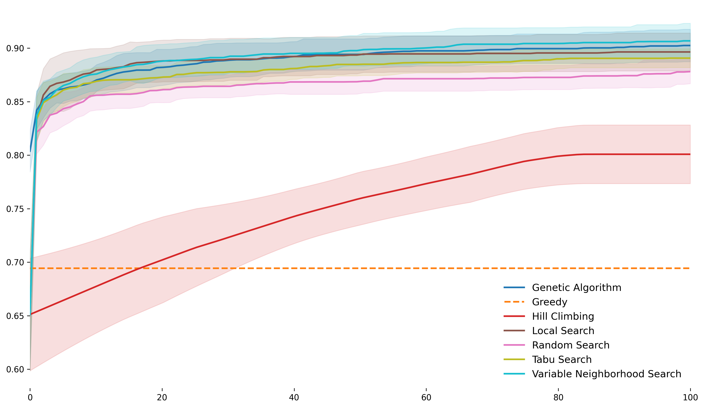
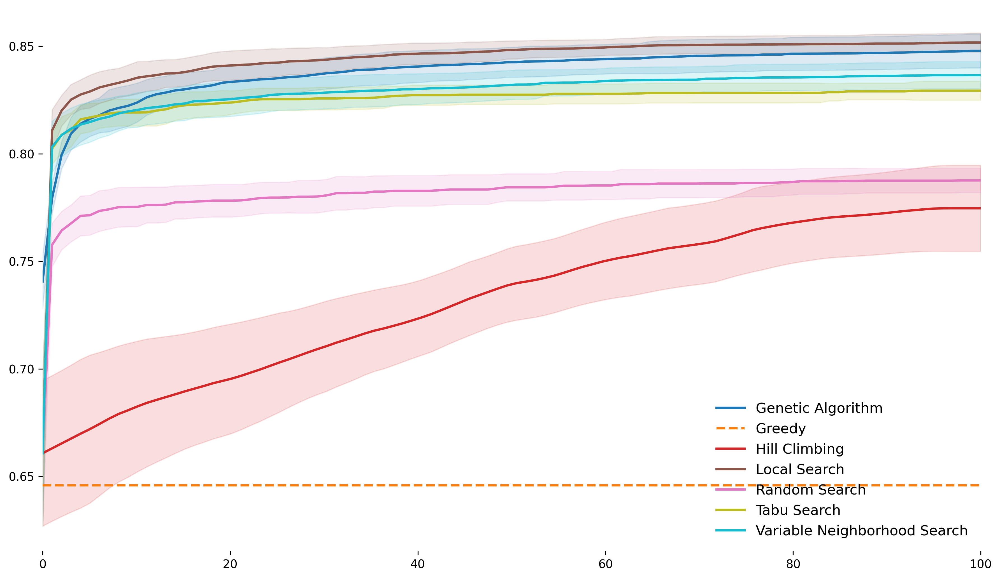
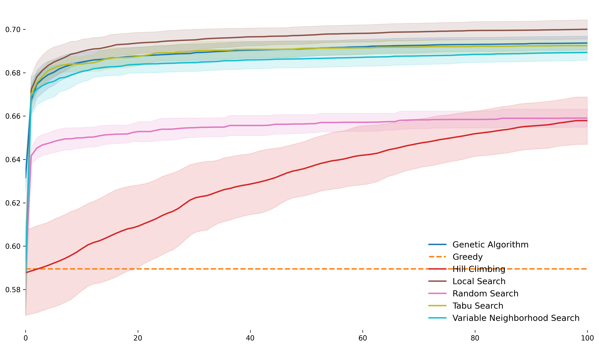

# Un Marco Heurístico Completo para el Problema de Formación de Múltiples Equipos Sociométricos

**Ignacio Martínez Hernández**  
Doctorado en Sistemas de Ingeniería  
Universidad de Talca

_Presentación Conferencia IEEE_

---

## 1. Introducción y Motivación

- Las organizaciones ejecutan múltiples proyectos simultáneamente
- El rendimiento del equipo depende de **habilidades técnicas** + **afinidad social**
- **Problema de Formación de Múltiples Equipos (MTFP)**: Asignar recursos humanos a múltiples proyectos considerando:
  - Requerimientos de habilidades
  - Matrices sociométricas (afinidad interpersonal)
  - Niveles de dedicación fraccional

**Limitación del trabajo previo**: Dependencia de solucionadores exactos de Programación por Restricciones (CP) → sobrecarga computacional

---

## 3. Formulación Matemática

**Objetivo**: Maximizar la eficiencia sociométrica global

$$E = \sum_{l \in \mathcal{P}} w_l \cdot \frac{1}{2} \left(1 + \frac{\sum_{i,j} s_{ij} x_{il} x_{jl}}{\left(\sum_k r_{kl}\right)^2}\right)$$

**Restricciones**:

1. Capacidad: $\sum_l x_{il} \le 1$
2. Requerimientos de habilidades: $\sum_{i \in Q_k} x_{il} = r_{kl}$
3. Dedicación discreta: $x_{il} \in \mathcal{D}$

**Sets y Parámetros**:

- $\mathcal{H}$: Personas, $\mathcal{P}$: Proyectos, $\mathcal{K}$: Habilidades
- $S$: Matriz sociométrica, $w_l$: Pesos de proyectos
- $\mathcal{D}$: Niveles de dedicación discretos

---

## 4. Metodología: Heurística Central

### Randomized Greedy Constructive Heuristic (RGCH)

- Reemplaza el solver CP exacto
- Explota la **descomposición del problema por habilidad**
- Pasos:
  1. Reiniciar asignaciones para habilidad $k$
  2. Aleatorizar candidatos
  3. Asignación gready para cumplir requerimientos

---

## 4.1 Estructura de Vecindario ($N^1$)

- Seleccionar una categoría de habilidad $k$
- Eliminar todas las asignaciones para $k$
- Reconstruir usando RGCH

**Propiedad clave**: Cada vecino es factible → No se necesitan mecanismos de reparación

---

## 4.2 Algoritmos Comparados

**Líneas base**:

- Greedy Determinista (DG)
- Búsqueda Aleatoria (RS)

**Basados en trayectoria**:

- Hill Climbing (HC)
- Stochastic Local Search (SLS)
- Tabu Search (TS)

**Basados en población**:

- Genetic Algorithm (GA)

**Metaheurística**:

- Variable Neighborhood Search (VNS)

---

## 5. Configuración Experimental

### Escalas de Instancias

| Escala  | Personas | Proyectos | Habilidades |
| ------- | -------- | --------- | ----------- |
| Pequeña | 20       | 3         | 2           |
| Mediana | 100      | 10        | 10          |
| Grande  | 200      | 20        | 20          |

**Densidad sociométrica**: 30% relaciones positivas

---

### Parámetros Algorítmicos

| Algoritmo | Parámetro               | Valor              |
| --------- | ----------------------- | ------------------ |
| Común     | Presupuesto NFE         | 20k-100k           |
| GA        | Tamaño Población        | 100                |
| TS        | Tamaño Lista Candidatos | max(20, 2\|K\|)    |
| VNS       | Intensidad Shaking      | Dinámica (1-\|K\|) |
| SLS       | Estrategia              | Exhaustiva         |

**Análisis Estadístico**: Prueba de Wilcoxon para comparaciones pareadas

---

## 6. Resultados: Resumen de Rendimiento

| Algorithm         | Mean ± Std        | Best      | Time(s)  | Mean ± Std        | Best      | Time(s)  | Mean ± Std        | Best      | Time(s)  |
| ----------------- | ----------------- | --------- | -------- | ----------------- | --------- | -------- | ----------------- | --------- | -------- |
| Greedy            | 0.694 ± 0.000     | 0.694     | **0.01** | 0.646 ± 0.000     | 0.646     | **0.01** | 0.590 ± 0.000     | 0.590     | **0.01** |
| Hill Climbing     | 0.801 ± 0.028     | 0.855     | 0.01     | 0.775 ± 0.020     | 0.812     | 0.32     | 0.658 ± 0.011     | 0.672     | 3.68     |
| Random Search     | 0.878 ± 0.011     | 0.912     | 8.50     | 0.788 ± 0.006     | 0.800     | 1129.1   | 0.659 ± 0.004     | 0.669     | 16692.9  |
| Tabu Search       | 0.891 ± 0.009     | 0.912     | 4.99     | 0.829 ± 0.004     | 0.841     | 149.6    | 0.692 ± 0.003     | 0.699     | 1104.7   |
| Genetic Alg. (GA) | 0.903 ± 0.015     | 0.932     | 11.77    | 0.848 ± 0.008     | **0.862** | 250.6    | 0.694 ± 0.003     | 0.700     | 2036.3   |
| VNS               | **0.907 ± 0.017** | **0.939** | 5.23     | 0.837 ± 0.006     | 0.849     | 163.0    | 0.689 ± 0.004     | 0.697     | 1284.5   |
| Stoch. LS         | 0.896 ± 0.018     | **0.939** | 4.98     | **0.852 ± 0.004** | 0.861     | 148.1    | **0.700 ± 0.004** | **0.708** | 1103.4   |

---

## 6.1 Análisis por Instancia

**Pequeña (N=20)**:

- VNS y GA equivalentes ($p = 0.187$)
- VNS 2.2× más rápido → Recomendado

**Mediana (N=100)**:

- SLS supera GA ($p = 0.0035$) y VNS ($p < 0.001$)
- SLS más rápido que GA (148s vs 250s)

**Grande (N=200)**:

- SLS domina ($p < 10^{-6}$ vs GA)
- Persistencia simple supera mecanismos complejos

---

## 6.2 Comportamiento de Convergencia

---

&nbsp;

---

&nbsp;

---

&nbsp;

---

## 6.3 ¿Por qué SLS Sobresale?

**Paradoja**: Algoritmo simple supera metaheurísticas sofisticadas

**Razones**:

1. **Explotación persistente**: SLS explora exhaustivamente $N^1$
2. **Paisaje MTFP**: Altamente restringido, favorece búsqueda focalizada
3. **Limitación VNS**: Búsqueda local superficial limita convergencia

**Significancia**: Diferencias pequeñas pero altamente significativas por baja varianza ($p < 10^{-6}$)

---

## 7. Conclusiones

1. **Marco heurístico completo** elimina dependencia de solvers CP
2. **RGCH** garantiza factibilidad eficientemente
3. **SLS** emerge como el algoritmo más escalable
4. **Hallazgo contraintuitivo**: Búsqueda persistente supera complejidad en instancias grandes

**Implicación práctica**: Para MTFP de alta dimensión, explotación intensiva supera diversificación agresiva

**Limitaciones**: Individuos mono-habilidad, instancias sintéticas

---

## 8. Trabajo Futuro

1. **Extensiones del problema**:

   - Múltiples habilidades por persona
   - Requerimientos dinámicos
   - Competencias superpuestas

2. **Mejoras algorítmicas**:

   - VNS adaptativo con intensidad auto-ajustable
   - Enfoques híbridos SLS + diversidad GA

3. **Validación real**: Aplicar a casos industriales

---
